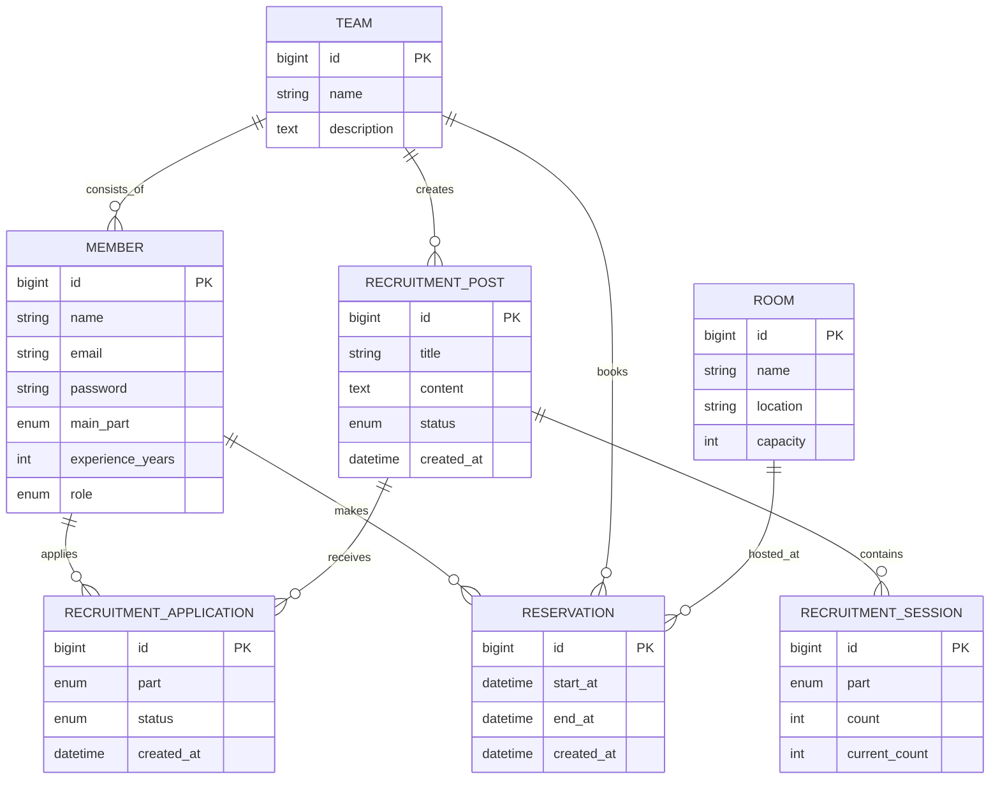

# 🏛️ Architecture & Design

Aulim 프로젝트의 시스템 구조와 핵심 설계 의사결정을 기술합니다.

---

## 1. 데이터베이스 설계 (ERD)

Aulim의 데이터 모델은 밴드 구인과 연습실 예약이라는 두 개의 큰 도메인을 중심으로 설계되었습니다.

---

## 2. 핵심 비즈니스 로직: 예약 제한 시스템

Aulim은 팀원들이 공평하게 연습실을 사용할 수 있도록 강력한 예약 제한 로직을 서비스 레이어에서 관리합니다.

### 🛡️ 정책: 팀당 하루 최대 2시간(120분)
이 로직은 `ReservationService.java`의 `validateReservationTime` 메서드에 구현되어 있습니다.

1. **범위 계산**: 예약 요청 시점의 날짜(`LocalDate`)를 기준으로 해당 일의 시작(`00:00:00`)과 끝(`23:59:59`) 범위를 설정합니다.
2. **기존 예약 조회**: 해당 날짜에 해당 팀이 이미 완료한 예약 목록을 DB에서 조회합니다.
3. **시간 합산**: 기존 예약 시간과 새로 요청된 예약 시간을 합산하여 **120분**을 초과하는지 검증합니다.
4. **예외 처리**: 제한 시간을 초과할 경우 `IllegalStateException`을 발생시켜 트랜잭션을 롤백하고 사용자에게 남은 시간을 안내합니다.

---

## 3. 보안 아키텍처 (Security)

### JWT 기반 무상태 인증
- **JwtAuthenticationFilter**: 모든 요청에 대해 `Authorization` 헤더의 JWT를 검증하고 `SecurityContextHolder`에 인증 정보를 저장합니다.
- **Spring Security**: `SecurityConfig`를 통해 API 경로별 권한을 세밀하게 제어합니다.
    - `/api/auth/**`, `/api/recruits/**` (GET): 누구나 접근 가능
    - `/api/reservations/**`, `/api/mypage/**`: 인증된 사용자만 접근 가능

### CORS 설정
Next.js 프론트엔드(`localhost:3000`)와의 원활한 통신을 위해 특정 오리진과 HTTP 메서드를 허용하는 CORS 설정이 백엔드에 적용되어 있습니다.

---

## 4. API 인터페이스
- **RESTful API**: 리소스 중심의 URL 설계와 HTTP Method(GET, POST, PUT, DELETE)를 적절히 활용하여 직관적인 API를 제공합니다.
- **DTO 전송**: Entity를 직접 노출하지 않고, 상황에 맞는 DTO(Data Transfer Object)를 사용하여 데이터 캡슐화와 보안을 강화했습니다.
